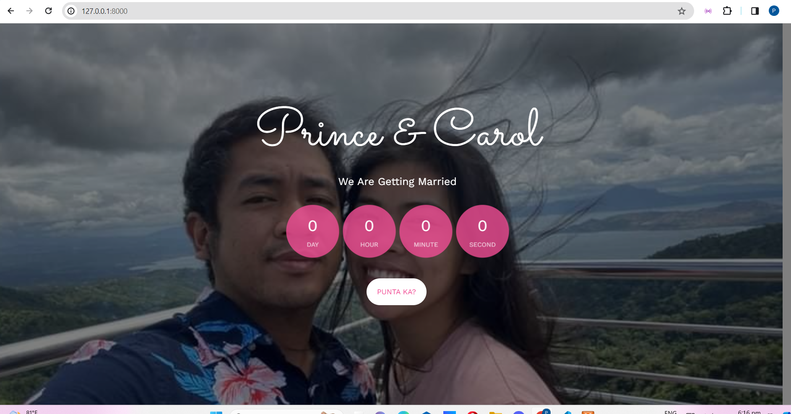
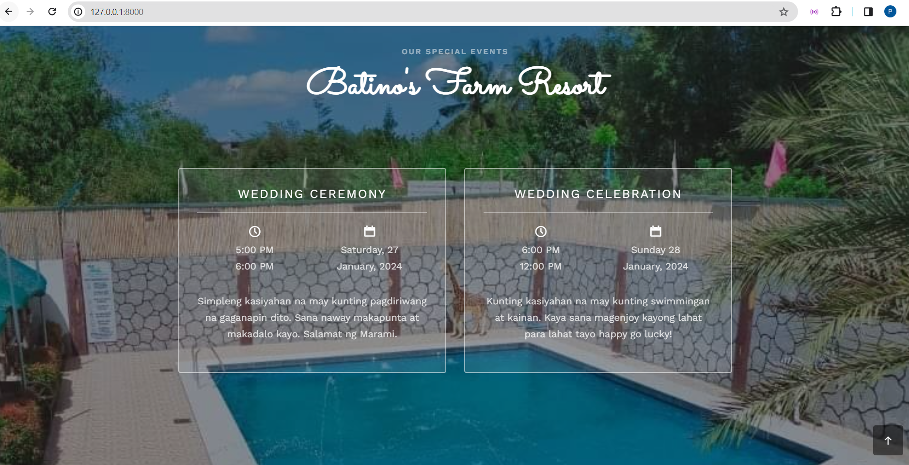
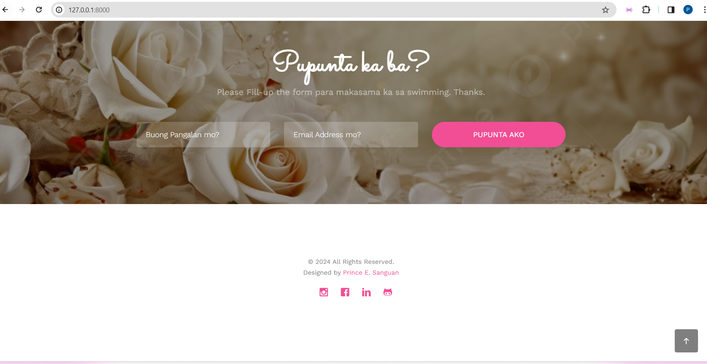
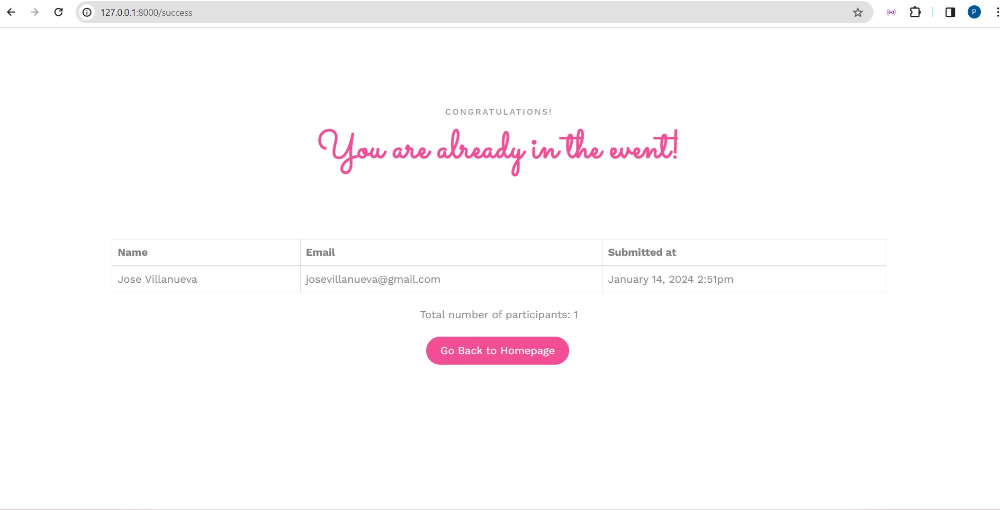

# Wedding Website

Welcome to our wedding website! This platform has been created to share the joy of our upcoming wedding celebration with our friends and family. It not only serves as an informational hub for the details of the wedding but also includes a special invitation feature.

## Features

### Wedding Details

-   Get all the essential information about our wedding day, including the date, time, and venue. We've also included a map for your convenience, so you can easily find your way to the celebration.
    

### Invitation Feature

-   To provide a unique experience, we've implemented an invitation feature. If you log in to the website, you are automatically considered invited. This allows us to customize the content for our invited guests.
    

### RSVP Functionality

-   Once you log in, you'll have the option to RSVP directly on the website. This helps us in planning for the number of guests attending and ensures that everyone feels included in our special day.
    

### Feedback

-   We'd love to hear your thoughts on the website! If you encounter any issues, have suggestions, or just want to share your excitement about our wedding, feel free to reach out to us through the provided contact information.

Check it out at my live website [here]!(https://www.princecarolwedding.free.nf).
